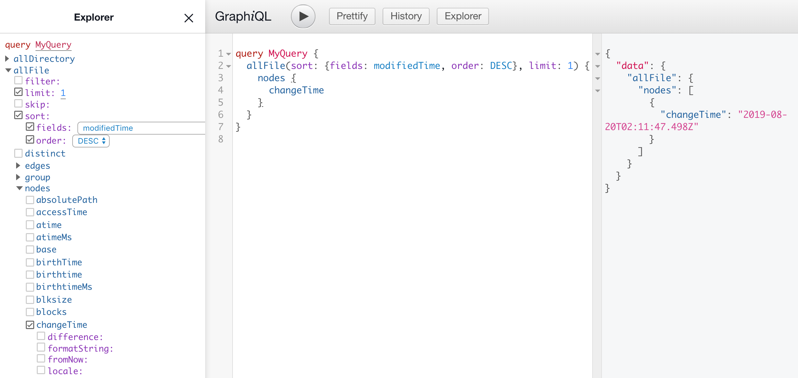

# About
Gatsby Series Part 1 was all about the Gatsby data layer, and this article is all about using static queries to fetch that data.  If you need a refersher on the Gatsby data layer you can find it @ [Data Layer Refresher](https://www.olli.codes/blog/Tranform%20.md%20files%20to%20html/).

I am particularly excited about this article since I have been recently using React Hooks, and now Gatsby V2.1.0 has introduded `useStaticQuery` which allows the use of a React Hook to query with GraphQL.

# Note
This article assumes that you allready have a running Gatsby project.  If you do not have one, a good place to get started is at [getting started](https://www.gatsbyjs.org/docs/).

# Introducing Gatsby Queries
In order to access the data within Gatsby's data layer, you need to use queries.  Gatsby provides two different types of queries which are `Static Queries`, and `Page Queries`.  The main difference between the two is that `Page Queries` can only be used with pages, and `Static Queries` can be used with all components.  For a more in depth article on the difference between them go to [Static Queries Vs. Page Queries](https://www.gatsbyjs.org/docs/static-vs-normal-queries/).  Since in this article we will be using a query to fetch the date a website was last updated and displaying that data in the footer(not a page), we will be using the static query.

# Static Queries With Hooks
Before we start implementing queries in our component, lets run the Gatsby project on local host and explore the data layer with QraphiQL.  In the terminal type 
```
gatsby develop
```
If you do not have the Gatsby CLI setup, you may need to run the following command
```
npm install -g gatsby-cli
```
and follow the path to GraphiQL, in your terminal the path will look like this.
```
View GraphiQL, an in-browser IDE, to explore your site's data and schema

http://localhost:8001/___graphql
```
It turns out that Gatsby out of the box logs the time and date a node (fancy Gatsby lingo for component) has changed.  We will be using the Explorer in GraphiQL to create our query to get this information.  

After some digging with Explorer I found the path to the changeTime that I was looking for.


The only problem with this query is that it returns the change time of all nodes in my Gatsby project and in no particular order.  How do we fix this?  Gatsby was nice enough when they created their QraphQL schema that they added an option to sort and limit the number of results.  So after a little more digging around in the Explorer I was able to limit the number of results of our query to 1, and sort the results in a decending order by modified time.



Now that we have developed our query in QraphiQL, lets go and implement it in our code!


Referring to the code above, in order to use the fancy `useStaticQuery` hook, you must first import a couple of items.
```
import { useStaticQuery, graphql } from "gatsby"
```

The result of the query is now assigned to the constant `queryResult`, and everything in the orange color is the query that we developed with GraphiQL.  From here on out I just assign the date fetched from the query to the constant `slicedTime`, and slice off the time following the date since I'm not interested in it.  

#Conclusion
My first reaction to using the `useStaticQuery` hook to fetch data from the data layer is that it is a bit cleaner and easier to read than the old way.  If you are curious to what the old way `StaticQuery` looked like, check out this link [StaticQuery](https://www.gatsbyjs.org/docs/static-query/).


