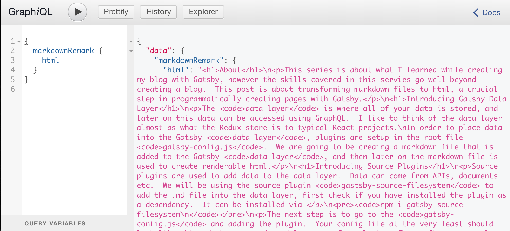

# About
This article is about exploring the Gatsby data layer.  We will be doing this by transforming a markdown file into renderable html.   This can be very useful for instance when programatically creating pages with Gatsby.

# Introducing Gatsby Data Layer
The `data layer` is where all of your data is stored, and later on this data can be accessed using `GraphQL`.  I like to think of the data layer almost as what the Redux store is to typical React projects.  In order to place data into the Gatsby `data layer`, plugins are setup in the root file `gatsby-config.js`.  We are going to be creaing a markdown file that is added to the Gatsby `data layer`, and then later on the markdown file is used to create renderable html.

#Introducing Source Plugins
Source plugins are used to add data to the `data layer`.  Data can come from APIs, documents, etc.  We will be using the source plugin `gastsby-source-filesystem` to add the .md file into the `data layer`, first check if you have installed the plugin as a dependancy.  It can be installed via 
```
npm i gatsby-source-filesystem
```
The next step is to go to the `gatsby-config.js` and adding the plugin. This file should live in your root directory.  Your config file at the very least should look like this.
```
module.exports{
  plugins: [
    {
      resolve: `gatsby-source-filesystem`,
      options: {
        name:'pages',
        path: `${__dirname}/src/pages`
      }
    }
  ]
}
```
Under the options object, the path should point to the folder that the contents of which you want to add to the `data layer`.  The name can be used to filter results when you get to fetching the data from the `data layer`.

#Introducing Transformer Plugins
In order to transform the .md file to a html file, we will be using the transformer plugin `gatsby-transformer-remark`.  In order to start using this plugin, first it needs to be installed as a dependency, with npm the installation looks like this.
```
npm i gatsby-transformer-remark
```
The second step is to add the plugin to `gatsby-config.js`.  Note that the exmple below is simplified, and your `gatsby-config.js` file will likely have plenty of additional plugins.
```

module.exports{
  plugins: [
    {
      resolve: `gatsby-source-filesystem`,
      options: {
        name:'pages',
        path: `${__dirname}/src/pages`
      }
    },
    `gatsby-transformer-remark`
  ]
}
```
This plugin will search for all .md files in the `data layer` and convert them html files.  Note that if the `gatsby-source-file-system` was not used to add the .md file into the `data layer`, then the plugin will not find the .md file and therefore will not transform it into an html file.

#Accessing the Data Layer with GraphiQL

`GraphiQL` is an awesome tool which allows you to test `GraphQL` queries before running them in your code.  Gatsby comes out of the box with `GraphiQL` setup.  Once you build your Gatsby project and run it locally, you will get the option to open up `GraphiQL` and query data from the `data layer`.

There are several ways to build and run your Gatsby project locally.  One is to install the `Gatsby CLI` in the terminal. 
```
npm install -g gatsby-cli
```
When you have the CLI installed run the following commands in the termainal.
```
gatsby build
gatsby run develop
```
In your terminal you should now get something that looks similar to this.
```
You can now view gatsby-starter-default in the browser.⠀
http://localhost:8000/
⠀
View GraphiQL, an in-browser IDE, to explore your site's data and
http://localhost:8000/___graphql
```

After opening up `GraphiQL`, you can query the `data layer` for the html as such.  Below you can see the html that was transformed from the .md file used to render this blog post.




